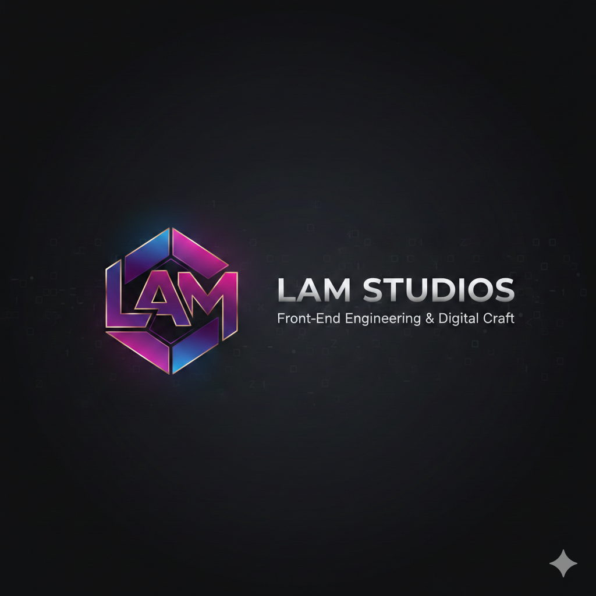

  

# Lam Nguyen | Web Developer 🚀
**Founder of LAM Studios** *Specializing in High-Performance Web Architecture & Fluid UI/UX Design*

---

### 🎓 Academic Excellence
- **Current Institution:** triOS College (Web Development Program, 2025 - 2026)
- **Academic Standing:** 98% Average
- **Focus:** Modern CSS (Grid/Flexbox), Vanilla JS DOM Manipulation, AI-Driven Solutions and API Integration.

---

### 🛠️ Technical Arsenal
| Category | Tools & Technologies |
| :--- | :--- |
| **Core Dev** | HTML5, Modern CSS (Fluid Layouts, `clamp()`), JavaScript (ES6+) |
| **Design** | Figma (Prototyping), Adobe Suite (Photoshop, Illustrator) |
| **Workflow** | macOS, VS Code, Git/GitHub, Netlify |
| **CMS** | WordPress FSE & Custom Block Templates |

---

### 🚀 Featured Works

#### [Mint & Measure](https://lamnguyen.ca/mint_measure)
*Logic-driven kitchen utility featuring high-performance unit conversion.*
- **Security:** Implemented a server-side proxy to protect API keys.
- **AI Integration:** Features a custom Gemini-powered chat interface.
- **Connectivity:** Real-time data via TheMealDB and Spoonacular APIs.

#### [Heartland Harmony](https://lamnguyen.ca/heartland_harmony)
*A premier country music festival showcase.*
- **Dual Prototype:** Features both Web and App interactive Figma prototypes.
- **Engineering:** Built with a custom 3D-tilt engine and local grid-fade depth layering.

#### [Raise Your Vibration](https://raiseyourvibration5.wordpress.com)
*Spiritual wellness platform focused on high-frequency content.*
- Developed using WordPress Full Site Editing (FSE) and custom modular blocks.

---

### 📬 Let's Connect
- **Portfolio:** [lamnguyen.ca](https://lamnguyen.ca)
- **Location:** Forest, Ontario
- **Objective:** Seeking Web or Application Programmer/Developer internship opportunities to apply professional modern industry standards.

*"Expensive, mature, and highly engineered."*
